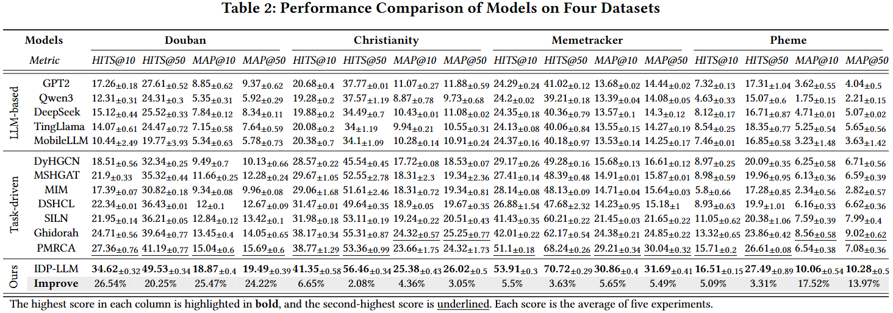
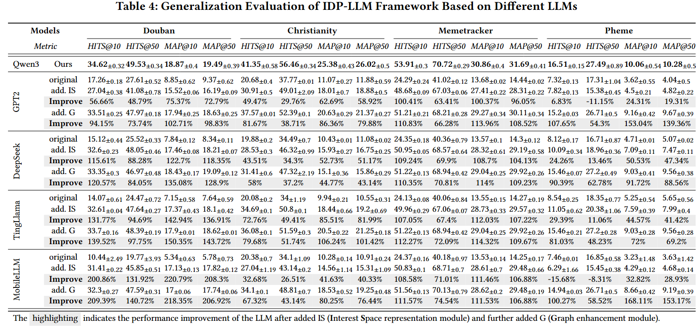

# MIDP-GLLM: Domain-Adaptive Alignment Graph-aware LLM for Malicious Information Diffusion Prediction

[](https://python.org)
[](https://huggingface.co/transformers/)
[](https://github.com/huggingface/peft)
[](https://pytorch-geometric.readthedocs.io)
[](https://github.com/facebookresearch/faiss)

Official implementation of the paper:  
**"MIDP-GLLM: Domain-Adaptive Alignment Graph-aware LLM for Malicious Information Diffusion Prediction"**

> We propose a novel paradigm that integrates Graph-aware Large Language Models (LLMs) to unify semantic depth and structural reasoning, addressing the representation challenges caused by extreme topological sparsity in malicious diffusion.

## 🌟 Key Ideas

- **Domain-Adaptive Token Alignment**: Smoothly maps heterogeneous graph representations into the LLM's native token space through a two-stage mechanism:
  - **Semantic-Cognitive Prototype Alignment**: Establishes semantic anchors via clustering-based contrastive learning to bridge the semantic domain gap between general knowledge and specific intent.
  - **Cross-layer Topological Awareness**: Mitigates the over-smoothing problem in deep graph aggregation through cross-layer contrastive learning, preserving structural discriminability.
- **Graph-aware Reasoning Architecture**: Innovatively redesigns the LLM's internal mechanisms to perceive social structures:
  - **Graph-aware Multi-head Attention (MHGA)**: Explicitly injects social network topology into the attention computation to overcome the LLM's "structural blind spot".
  - **Higher-order Dependency Capture**: Modulates attention operators with structural priors to precisely perceive social influence and homophily.
- **Paradigm Shift**: Unlike traditional methods that fragment feature extraction and sequence prediction, our framework achieves deep integration through the unified internal mechanism of the LLM.
- **Superior Generalization & Efficiency**: Demonstrates significant performance gains across various lightweight LLMs (e.g., Qwen3, DeepSeek, MobileLLM) while maintaining low inference latency.

## 📊 Dataset Reconstruction (Misderdect)

To address the **topological sparsity** of malicious spread found in traditional datasets like Douban, we reconstructed the Misderdect dataset:
1. **Core Corpus Establishment**: Integrated verified rumor and fake news topics flagged by official platforms.
2. **Cascade Modeling**: Established diffusion paths by collecting user comment and repost reactions.
3. **Relationship Enhancement**: Extracted multi-dimensional social ties (Following, Fans, Likes) to construct a structurally rich, multi-relational social graph.

## ⚠️ Important Requirements for Reproduction

### 🔥 Critical Configuration Requirements:

1. **Library Version Consistency**: 
   > **⚠️ CRITICAL**: All code must use `transformers 4.55.2` version. Using other versions will cause the system to fail. This is essential for proper functionality.

2. **Model Path Configuration**:
   > **⚠️ CRITICAL**: You must manually modify the pre-trained LLM weight paths in the model files to match your local paths, otherwise loading will fail. Pay special attention to the `llm_path` parameter in the model files before running.

## 📈 Main Results
We compare IDP-LLM against seven baselines: [DyHGCN](https://link.springer.com/chapter/10.1007/978-3-030-67664-3_21), [MS-HGAT](https://ojs.aaai.org/index.php/AAAI/article/view/20334), [MIM](https://ieeexplore.ieee.org/abstract/document/10994219/), [DSHCL](https://ieeexplore.ieee.org/abstract/document/11062122/), [SILN](https://dl.acm.org/doi/abs/10.1145/3711896.3736925), [Ghidorah](https://ojs.aaai.org/index.php/AAAI/article/view/33470), and [PMRCA](https://dl.acm.org/doi/abs/10.1145/3726302.3729883). We also evaluate with lightweight LLMs: [GPT-2](https://huggingface.co/openai-community/gpt2-large), [Qwen3-1.7B](https://huggingface.co/Qwen/Qwen3-1.7B), [DeepSeek-R1-Distill-Qwen-1.5B](https://huggingface.co/deepseek-ai/DeepSeek-R1-Distill-Qwen-1.5B), [TinyLlama-1.1B](https://huggingface.co/TinyLlama/TinyLlama-1.1B-Chat-v1.0), and [MobileLLM-R1.5-950M](https://huggingface.co/facebook/MobileLLM-R1.5-950M).
### - Information Diffusion Prediction

### - Generalization Evaluation of Different LLMs

## ▶️ Quick Start

### 📁 Project Structure
```bash
├── data/    ## Public Datasets
│   ├── christianity/
│   │   ├── cascades.txt
│   │   ├── edges.txt
│   │   ├── idx2u.pickle
│   │   ├── u2idx.pickle
│   ├── douban/
│   │   ├── cascades.txt
│   │   ├── edges.txt
│   │   ├── idx2u.pickle
│   │   ├── u2idx.pickle
│   ├── memetracker/
│   │   ├── cascades.txt
│   │   ├── edges.txt
│   │   ├── idx2u.pickle
│   │   ├── u2idx.pickle
│   ├── Misderdect/
│   │   ├── cascades.txt
│   │   ├── edges.txt
│   │   ├── idx2u.pickle
│   │   ├── u2idx.pickle
│   ├── weight/
├── helpers/
│   ├── BaseLoader.py   # Dataset Loading and Processing
│   ├── BaseRunner.py   # Model Training, Validation, and Testing
├── layers/
│   ├── Commons.py
│   ├── GraphBuilder.py
│   ├── TransformerBlock.py
├── log/
├── models/
│   ├── DyHGCN.py  # DyHGCN Model
│   ├── Graph_LLM.py
│   ├── Graph_LLM_Deepseek.py
│   ├── Graph_LLM_GPT2.py
│   ├── Graph_LLM_Llama.py
│   ├── Graph_LLM_MobileLLM.py
│   ├── IDP_LLM.py
│   ├── IDP_LLM_LoRA.py  # IDP-LLM Model, Before use, **please verify that the llm_path parameter is correct.**
│   ├── LLMNet.py
│   ├── MIM.py     # MIM Model
│   ├── PMRCA.py   # PMRCA Model
├── utils/
│   ├── Constants.py
│   ├── Metrics.py
│   ├── Optim.py
│   ├── Utils.py
├── README.md
├── requirements.txt
├── run.py
├── saved/
```

### Installation

```bash
git clone https://github.com/yzhouli/IDP-LLM.git
cd IDP-LLM
pip install -r requirements.txt
python run.py
```
